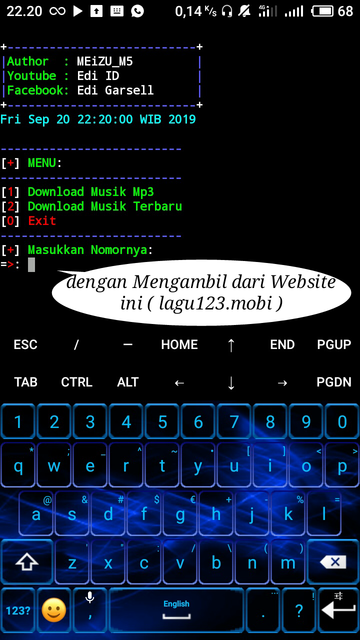

Cara Download script melalui Termux. Cukup ketikan perintah seperti di bawah ini:

```
$ pkg update && pkg upgrade
$ pkg install git
$ pkg install python
$ termux-setup-storage
$ cd storage
$ cd downloads
$ git clone https://github.com/MEiZU-M5/Download-mp3.git
$ cd Download-mp3
$ pip install -r requirements.txt
$ python lagu123.py
```

NOTE :
jika ada kata - kata [y/n] ketik y lalu Enter,
silahkan di Coba semoga bermanfaat...

# GAMBAR SCRENSHOOT


# Sosial Media :
* 👉 [Pollow Facebook](https://www.facebook.com/edi.garsella)
* 👉 [Instagram](https://www.instagram.com/edi.garsell/?hl=id)
* 👉 [Subcribe Channell Edi ID](https://www.youtube.com/channel/UCr1X7uS9_FEjITKDah2FxXw)
* 👉 [Repositories](https://github.com/MEiZU-M5?tab=repositories)
